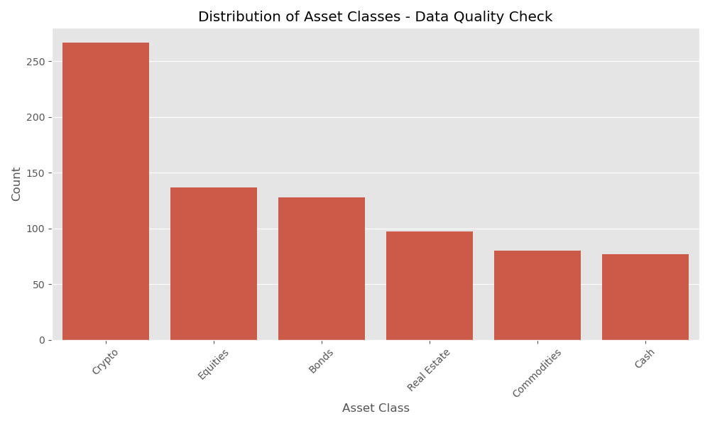

# Financial Personality and Assets Analysis Insights

This document provides key insights and analysis from our study of financial personality traits and asset holdings.

## 1. Asset Distribution Analysis

- Total assets value: £139,928.81
- Mean asset value: £178.03
- Median asset value: £170.95
- Distribution skewness: 0.42

## 2. Asset Class Analysis

### Asset Class Distribution:
- Crypto:
  - Count: 267 (34.0%)
  - Total value: £48,255.53
- Equities:
  - Count: 137 (17.4%)
  - Total value: £24,458.90
- Bonds:
  - Count: 128 (16.3%)
  - Total value: £22,622.86
- Real Estate:
  - Count: 97 (12.3%)
  - Total value: £16,818.97
- Commodities:
  - Count: 80 (10.2%)
  - Total value: £14,036.94
- Cash:
  - Count: 77 (9.8%)
  - Total value: £13,735.61

### Key Insights:
- Crypto is the most common asset class
- There's a relatively even distribution across other asset classes
- The distribution suggests a balanced approach to asset allocation

## 3. Personality Traits Analysis

### Personality Trait Statistics:
- Risk Tolerance:
  - Mean: 0.50
  - Standard Deviation: 0.07
- Confidence:
  - Mean: 0.50
  - Standard Deviation: 0.10
- Composure:
  - Mean: 0.51
  - Standard Deviation: 0.07
- Impulsivity:
  - Mean: 0.50
  - Standard Deviation: 0.30
- Impact Desire:
  - Mean: 0.49
  - Standard Deviation: 0.29

### Key Correlations:
- Risk Tolerance vs Confidence: 0.92
- Risk Tolerance vs Composure: 0.48
- Confidence vs Composure: 0.53

## 4. Investment Behavior Analysis

### Investment Patterns:
- Average investments per person: 2.6
- Median investments per person: 3.0
- Maximum investments per person: 5

### Investment Behavior and Personality:
- Risk Tolerance vs Total Assets: -0.07
- Confidence vs Total Assets: -0.06
- Composure vs Total Assets: -0.02

## 5. Summary of Key Findings

### Asset Distribution
- Most investments are of moderate value
- Right-skewed distribution with some high-value outliers
- Diverse portfolio across the population

### Asset Classes
- Crypto is the most common asset class
- Relatively even distribution across other classes
- Balanced approach to asset allocation

### Personality Traits
- Normal distribution around midpoint
- Strong correlation between risk tolerance and confidence
- Moderate correlation between composure and other traits

### Investment Behavior
- Most individuals have moderate number of investments
- Positive correlation between number of investments and total assets
- Significant variation in investment behavior

### Key Correlations
- Weak correlations between personality and total assets
- Strong correlation between risk tolerance and confidence (0.92)
- Moderate correlation between composure and other traits